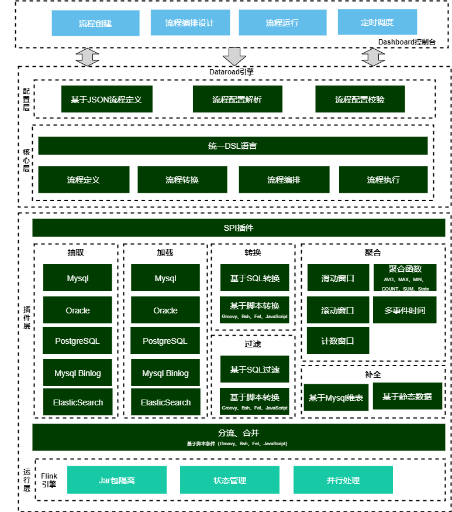
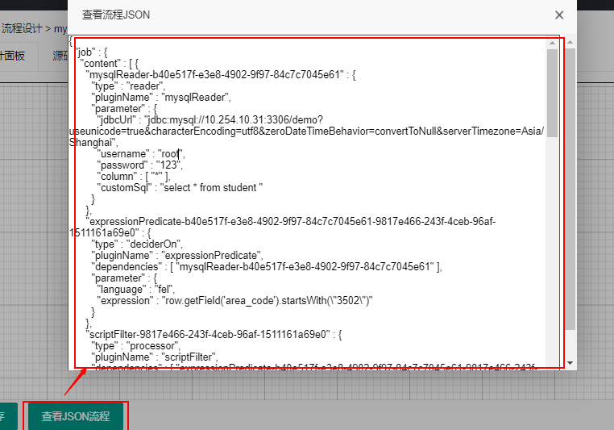
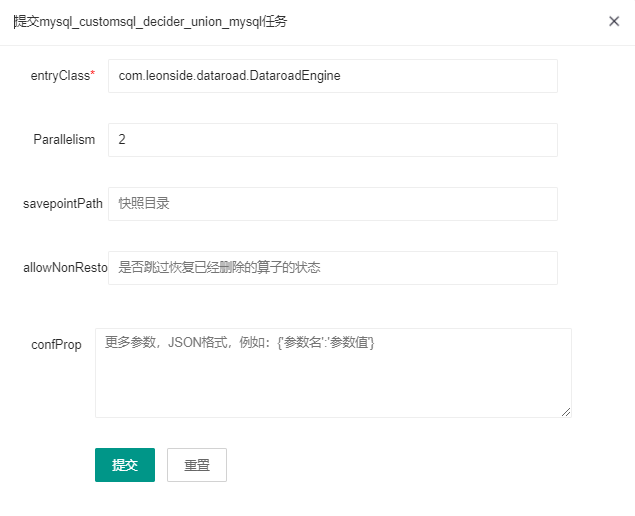

## Dataroad简介
### 概述

Dataroad是一款基于Flink的分布式离线/实时数据ETL工具，可实现多种异构数据源高效的数据同步。Dataroad吸收了FlinkX、DataX优秀的数据同步框架的设计思想和部分的插件功能，侧重于数据编排、处理转换、聚合计算等插件功能，提供了数据抽取、加载、过滤、转换、聚合计算、数据补全、分流合并等功能。同时Dataroad提供了Dashboard控制台，实现流程设计、编排、运行全生命周期管理，降低使用门槛。

另外，Dataroad采用SPI插件机制实现各组件，为组件的开发提供足够和扩展性和灵活度，方便开发人员自行扩展组件。


### 特性

- 支持数据抽取、加载、过滤、转换、聚合计算、数据补全等功能

- 支持流程编排，实现数据分流、合并，包含并行、条件、排他分支等场景。

- 采用轻量易用的JSON语言进行流程定义描述，同时也提供统一DSL语言来编排设计流程

- 支持基于窗口聚合计算，包含max、min、avg、count、sum、stats等几种聚合函数，其中窗口类型包含时间窗口（滚动窗口、滑动窗口）、计数窗口，时间窗口可以Event Time、Ingestion Time、Processing Time作为事件时间。

- 支持基于维表进行数据补全，维表可支持关系库（如Mysql）、静态数据等方式

- 支持Groovy、Bsh、Fel、JavaScript几种脚本引擎，实现数据的过滤、转换功能

- 支持并发读写数据，可以大幅度提升读写性能

- 关系数据库支持全量、增量轮询方式抽取数据，同时Mysql库支持基于Binlog方式同步数据

- 支持失败恢复功能，可以从失败的数据位置恢复任务，提升性能

- 提供Dashboard控制台，实现流程创建、可视化的流程编排设计、流程运行、流程调度等全生命周期管理。其中Dashboard支持采用Docker方式快速部署

- 支持多种运行模式，包含命令行运行方式、Dashboard控制台运行流程

- 扩展性：组件以SPI插件方式进行开发，包含了Reader、Writer、过滤转换器、聚合、维表补全、分流合并等组件。另外Dataroad采用分层设计的思想，运行层引擎同样采用SPI插件进行设计，方便后续的多引擎实现预留扩展性（如Spark引擎）。

- 支持插件Jar包隔离，按需动态加载相应的插件Jar包

  目前已支持的插件如下：

|  插件类型 |   插件类型说明     |  插件名称         |
| :------------------------------------------: | :----------------------------------------: | :-------------------------------------------: |
|                    reader |  读        |  [mysql](doc/plugin/mysql-reader.md) <br/> [mysql stream](doc/plugin/mysql-stream.md)<br/> [oracle](doc/plugin/oracle-reader.md)<br/> [postgresql](doc/plugin/postgresql-reader.md)<br/>  [elasticsearch](doc/plugin/elasticsearch-reader.md)<br/>             |
|                    writer |  写        | [mysql](doc/plugin/mysql-writer.md) <br/> [mysql stream](doc/plugin/mysql-stream.md)<br/> [oracle](doc/plugin/oracle-writer.md)<br/> [postgresql](doc/plugin/postgresql-writer.md)<br/>  [elasticsearch](doc/plugin/elasticsearch-writer.md)<br/>  |
|                  processor|  转换       |  [sql转换过滤](doc/plugin/sqltrans.md)<br/> [script转换](doc/plugin/scripttrans.md) <br/> [script过滤](doc/plugin/scriptfilter.md)  |
|                lookup     | 维表补全     |  [mysql](doc/plugin/lookup-mysql.md) <br/>  [静态数据](doc/plugin/lookup-direct.md)   |
|                 agg       | 聚合计算     |  [计数窗口聚合](doc/plugin/agg-countWindowAgg.md)  <br/>[滑动窗口聚合](doc/plugin/agg-slidingWindowAgg.md)  <br/>[滚动窗口聚合](doc/plugin/agg-tumblingWindowAgg.md)  <br/>    |
|                 deciderOn | 分流        |  [并行分支](doc/plugin/flow-forkjoin.md) <br/> [条件分支（包容分支）](doc/plugin/flow-forkjoin.md) <br/> [排他分支](doc/plugin/flow-forkjoin.md)   |
|                 union     | 合并        |  [合并](doc/plugin/flow-forkjoin.md)   |

### 整体架构




## 快速入门

### 代码下载

 使用git工具把项目clone到本地 (**如果只想通过Dashboard快速体验下Dataroad功能，可跳过此章节**)

```shell
git clone https://github.com/leonside/dataroad-all.git
cd dataroad-all
```

### 源码编译

进入dataroad-all目录下，执行如下命令(**如果只想通过Dashboard快速体验下Dataroad功能，可跳过此章节**)：

```shell
mvn clean package -DskipTests
```

其中dataroad插件存在在工程的同级目录dataroad-dist下。

注意：对于编译找不到的Jar包，如bsh、oracle等驱动包，在/dataroad-all/jars目录下有这些jar包，可进行手动安装，或者执行install_jars.sh一键安装，安装命令如：
```bash
mvn install:install-file -DgroupId=bsh -DartifactId=bsh -Dversion=1.0 -Dpackaging=jar -Dfile=./bsh-1.0.jar
mvn install:install-file -DgroupId=com.oracle -DartifactId=ojdbc6 -Dversion=11.2.0.1.0 -Dpackaging=jar -Dfile=./ojdbc6-11.2.0.1.0.jar
```

### 环境准备

#### Flink安装

详见Flink相关文档，示例中采用Flink standlone安装模式。

#### 初始化示例工程脚本

初始化本示例的SQL语句（另外Dashboard中附带了大量的示例流程）:

```sql
DROP TABLE IF EXISTS `student`;
CREATE TABLE `student` (
  `id` int(11) NOT NULL AUTO_INCREMENT,
  `name` varchar(50) DEFAULT NULL,
  `sex` smallint(6) DEFAULT NULL,
  `age` int(11) DEFAULT NULL,
  `address` varchar(255) DEFAULT NULL,
  `idcard` varchar(18) DEFAULT NULL,
  `phone` varchar(50) DEFAULT NULL,
  `code` int(11) DEFAULT NULL,
  `create_time` datetime DEFAULT NULL,
  `area_code` varchar(20) DEFAULT NULL,
  `score` double(255,0) DEFAULT NULL,
  PRIMARY KEY (`id`)
) ENGINE=InnoDB AUTO_INCREMENT=23 DEFAULT CHARSET=utf8;
INSERT INTO `student` VALUES ('1', '张三', '1', '18', '福建省', '11111111111111111', '13877777777', '1001', '2021-11-17 15:43:46', '350000', '500');
INSERT INTO `student` VALUES ('2', '李四', '0', '20', '厦门市', '11111111111111111', '13877777777', '1002', '2021-11-17 15:44:20', '350200', '480');
INSERT INTO `student` VALUES ('3', '王五', '0', '22', '厦门市', '11111111111111111', '13877777771', '1003', '2021-11-17 15:44:51', '350200', '500');
INSERT INTO `student` VALUES ('4', '王五2', '1', '22', '厦门市', '11111111111111111', '13877777771', '1004', '2021-11-17 15:44:51', '3502', '501');
INSERT INTO `student` VALUES ('5', '王五3', '0', '17', '漳州市', '11111111111111111', '13877777771', '1004', '2021-11-17 15:44:51', '3504', '602');
INSERT INTO `student` VALUES ('6', '王五', '1', '23', '厦门集美', '11111111111111111', '13877777771', '1005', '2022-01-26 08:54:46', '3504', '501');
INSERT INTO `student` VALUES ('7', '王六', '0', '23', '漳州', '11111111111111111', '13877777771', '1005', '2021-12-03 17:23:03', '3504', '501');
INSERT INTO `student` VALUES ('8', '王五', '0', '23', '厦门集美', '11111111111111111', '13877777771', '1005', '2022-01-26 08:54:46', '3501', '351');
INSERT INTO `student` VALUES ('9', '王五', '0', '23', '厦门集美', '11111111111111111', '13877777771', '1005', '2022-01-26 08:54:46', '3501', '501');
INSERT INTO `student` VALUES ('10', '王五', '0', '23', '厦门集美', '11111111111111111', '13877777771', '1005', '2022-01-26 08:54:46', '3501', '551');

DROP TABLE IF EXISTS `student1`;
CREATE TABLE `student1` (
  `id` int(11) NOT NULL DEFAULT '0',
  `name` varchar(50) DEFAULT NULL,
  `sex` smallint(6) DEFAULT NULL,
  `age` int(11) DEFAULT NULL,
  `address` varchar(255) DEFAULT NULL,
  `idcard` varchar(18) DEFAULT NULL,
  `phone` varchar(50) DEFAULT NULL,
  `code` int(11) DEFAULT NULL,
  `create_time` datetime DEFAULT NULL,
  `area_code` varchar(20) DEFAULT NULL,
  `score` double(255,0) DEFAULT NULL,
  `sex_value` varchar(255) DEFAULT NULL,
  PRIMARY KEY (`id`)
) ENGINE=InnoDB DEFAULT CHARSET=utf8;

DROP TABLE IF EXISTS `student2`;
CREATE TABLE `student2` (
  `id` int(11) NOT NULL DEFAULT '0',
  `name` varchar(50) DEFAULT NULL,
  `sex` smallint(6) DEFAULT NULL,
  `age` int(11) DEFAULT NULL,
  `address` varchar(255) DEFAULT NULL,
  `idcard` varchar(18) DEFAULT NULL,
  `phone` varchar(50) DEFAULT NULL,
  `code` int(11) DEFAULT NULL,
  `create_time` datetime DEFAULT NULL,
  `area_code` varchar(20) DEFAULT NULL,
  `score` double(255,0) DEFAULT NULL
) ENGINE=InnoDB DEFAULT CHARSET=utf8;

```


### 通过Dashboard方式运行任务

#### 部署Dashboard工程

##### 采用Docker方式运行Dashboard

执行如下命令运行dashboard

```java
docker run -d -p 8089:8089 -e WEB_UI=http://10.254.10.32:8081 -e DATAROAD_DIST=/opt/dataroad-dist/ -e HOST_ADDRESS=192.168.10.9 -e SAMPLE_ENABLED=true dataroad-dashboard:0.5 
```

其中环境变量说明如下：

|   环境变量    |       默认值        |                      说明                      |
| :-----------: | :-----------------: | :--------------------------------------------: |
|    WEB_UI     |         无          |               Flink的Web UI地址                |
| DATAROAD_DIST | /opt/dataroad-dist/ |             dataroad插件根路径地址             |
| HOST_ADDRESS  |     机器IP地址      | 如无法正确获取对外访问地址，可通过此参数配置IP |
| SAMPLE_ENABLE |         doc         |         是否初始化案例数据，默认false          |

##### 通过源码编译方式运行Dashboard Jar

执行如下命令运行Dashboard，可通过设置系统属性方式指定变量：

```shell
java -Dweb-ui=http://10.254.10.32:8081 -Ddataroad.sample-enabled=true -Ddataroad.dataroad-dist=/opt/dataroad-dist/ -Dhost-address=192.168.10.9 -jar dataroad-dashboard-0.5.jar
```


#### 流程设计

通过Dashboard创建并设计流程，本示例实现将学生信息student源表按区划分别抽取至student1、student2目标表中，中间经过数据过滤，流程图如下：


其中可通过“查看JSON流程”查看设计的流程JSON，如图：



#### 任务提交

进入Dashboard的流程运行菜单，选中已设计好的流程进行任务提交：



其中：提交流程可设置Flink相关参数，其中更多参数可通过confProp进行设置，例如：{\"parallelism.default\":2}

#### 查看任务

进入Flink Web UI，查看任务的运行情况。并查看目标表中的数据抽取情况。

### 通过命令行方式运行任务

#### 源码编译并获取部署包

​	详见如上代码下载、源码编译章节，获取dataroad-dist部署包及插件

#### 	上传服务器

​	将打包获取到的dataroad-dist插件包上传至部署Flink的服务器

#### 	流程设计

​	设计流程JSON，此处可通过Dashboard可视化流程设计器来设计流程（见上），并获取JSON流程配置（Dashboard已内置了一些流程JSON案例，可直接获取）。也可以自行设计流程，如下简要的说明流程JSON结构：


具体可参见[流程设计章节](doc/flow-designer.md)

#### 	任务提交

通过flink运行任务，运行脚本如下：

```shell
flink run dataroad-dashboard-0.5.jar -conf file:/tmp/mysql_customsql_decider_union_mysql.json -pluginRootDir /tmp/dataroad-dist -jobName myjob - confProp {\"parallelism.default\":1}
```

其中参数如下：

|   环境变量    | 是否必填 |                             说明                             |
| :-----------: | :------: | :----------------------------------------------------------: |
|     conf      |    是    | 流程JSON文件路径，支持file、http几种资源类型，如：-conf http://ip:port/api/jobflowjson/mysql_scriptfilter_mysql 直接引用Dashboard的设计流程 |
| pluginRootDir |    是    |         dataroad插件根路径地址，如/tmp/dataroad-dist         |
|  confProp否   |    否    |    Flink参数，采用Json格式，如{\"parallelism.default\":1}    |
|    jobName    |    否    |                           任务名称                           |


#### 	查看任务

进入Flink Web UI，查看任务的运行情况。并查看目标表中的数据抽取情况。

## Dashboard操作指南

请查看[[Dashboard操作指南](doc/dashboard-guide.md)]

## 流程设计说明

请查看[[流程设计说明](doc/flow-designer.md)]


## 写在最后
Dataroad是通过对工作中遇到的ETL场景进行总结，利用工作之外的业余时间编写的，个人精力有限，难免会有些不完善的地方欢迎指正（联系邮箱：408970922@qq.com）。另外，Dataroad框架如果对你有帮助的话也请点个赞，这是对我最大的鼓励！

